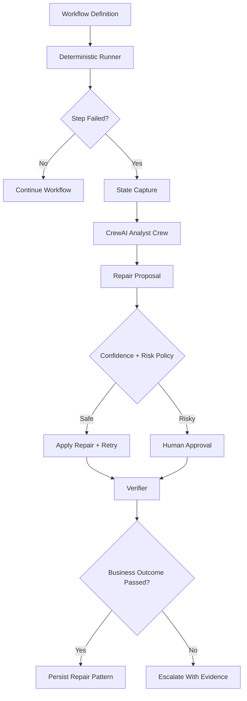
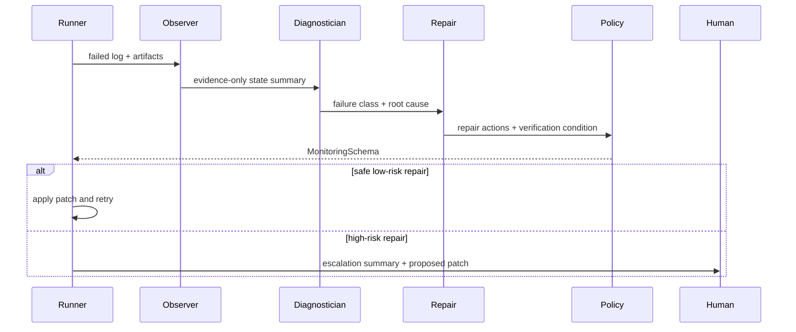

# Self-Healing Automation Engine Architecture

## Goal

Build a self-healing automation engine for app workflows. The normal path stays deterministic. CrewAI activates only when automation fails, becomes uncertain, or needs judgment.

## Core Principle

The engine is not “LLM clicks everything.”

The engine is:

1. deterministic runner executes known workflow steps;
2. failure artifacts are captured;
3. CrewAI diagnoses what changed;
4. CrewAI proposes a repair patch;
5. policy decides auto-apply vs human approval;
6. verifier confirms the business outcome;
7. successful repairs become reusable memory.

## High-Level Flow



## Product Wedge

Start with web automation before claiming every app.

Best first wedge:

> Self-healing Playwright automation for business workflows, with CrewAI-powered repair when selectors, layouts, or flows change.

Good early workflows:

- invoice approval;
- CRM record update;
- support ticket triage;
- report export;
- admin panel data entry.

Avoid promising:

> Any app, any task, fully autonomous.

That promise creates trust and safety problems too early.

## Main Runtime Components

### 1. Workflow Definition

A workflow step stores both intent and executable action.

Example:

```json
{
  "id": "submit_invoice_for_approval",
  "intent": "Submit the invoice for approval",
  "action": "click",
  "target": {
    "role": "button",
    "name": "Submit Invoice",
    "fallback_text": ["Send for Approval", "Submit for Approval"]
  },
  "risk": "financial_submission",
  "expected_outcome": "invoice status becomes Pending Approval"
}
```

The semantic intent matters because the repair crew needs to know what the step was trying to accomplish, not just which selector failed.

### 2. Deterministic Runner

The runner owns execution.

Use:

- Playwright for web apps;
- Appium for mobile apps;
- pywinauto, WinAppDriver, or accessibility APIs for desktop apps;
- native APIs where available.

Runner responsibilities:

- execute workflow steps;
- apply timeouts;
- run deterministic retries;
- capture screenshots;
- capture DOM or accessibility tree;
- collect console and network logs;
- store artifacts;
- call CrewAI only when it cannot safely continue.

CrewAI should not execute every click. CrewAI is the repair brain.

### 3. State Capture

When a step fails, capture the evidence needed for diagnosis.

Capture:

- workflow ID;
- run ID;
- failed step ID;
- failed step intent;
- current URL or app/window state;
- screenshot path;
- DOM or accessibility snapshot;
- console logs;
- network logs;
- prior successful trace;
- expected business outcome;
- risk metadata;
- operator notes if present.

Never put secrets into agent prompts.

## CrewAI Analyst Crew

Current architecture under `src/ai/agents/analyst` uses four agents in sequence.

### Observer Agent

Files:

- `src/ai/agents/analyst/crew.py`
- `src/ai/agents/analyst/config/agents.yaml`
- `src/ai/agents/analyst/config/tasks.yaml`

Purpose:

- read the failed automation log;
- summarize observed state;
- extract exact evidence;
- identify visible controls, errors, and app state;
- avoid proposing fixes.

Output should answer:

- What step failed?
- What was the expected intent?
- What is visible now?
- What evidence exists?

### Diagnostician Agent

Purpose:

- classify why the automation failed;
- explain what changed;
- separate root cause from uncertainty.

Failure classes:

- `none`
- `selector_changed`
- `text_changed`
- `layout_changed`
- `flow_changed`
- `authentication_expired`
- `permission_changed`
- `network_failure`
- `validation_changed`
- `app_bug`
- `automation_bug`
- `unknown`

### Repair Strategist Agent

Purpose:

- propose the smallest deterministic repair;
- preserve original semantic intent;
- produce patch-ready actions;
- prefer semantic selectors and accessibility roles;
- avoid brittle CSS and pixel coordinates.

Example repair:

```json
{
  "step_id": "submit_invoice_for_approval",
  "old_target": {
    "role": "button",
    "name": "Submit Invoice"
  },
  "new_action_sequence": [
    {
      "action": "click",
      "target": { "role": "button", "name": "More Actions" }
    },
    {
      "action": "click",
      "target": { "role": "menuitem", "name": "Send for Approval" }
    }
  ],
  "reason": "The approval action moved from a primary button into the More Actions menu.",
  "confidence": 0.82,
  "requires_human_approval": true
}
```

### Risk Policy Analyst Agent

Purpose:

- turn the diagnosis and repair into the final schema;
- enforce safety policy;
- decide whether to auto-apply, ask human, retry only, or escalate.

High-risk actions require human approval:

- money movement;
- financial submission;
- data deletion;
- permission changes;
- credential entry;
- MFA;
- external sends;
- legal or compliance workflow.

## Output Contract

Final analyst output is `MonitoringSchema` from `src/ai/agents/analyst/schemas.py`.

Fields:

```python
class MonitoringSchema(BaseModel):
    fix_needed: bool
    failure_class: FailureClass
    what_changed: str
    what_to_fix: dict[str, Any]
    suggested_repair: list[RepairAction]
    confidence_level: float
    risk_level: RiskLevel
    requires_human_approval: bool
    escalation_summary: str
    evidence: list[str]
```

Validation rules:

- `confidence_level` must be between `0` and `1`;
- `high` and `critical` risk repairs require `requires_human_approval=True`.

Repair action shape:

```python

from pydantic import BaseModel

class RepairAction(BaseModel):
    action: str
    target: str
    rationale: str
```

## Analyst Crew Flow



## Dummy AI Test Fixture

Test fixture:

- `tests/fixtures/dummy_automation_failure.log`

Scenario:

- invoice approval workflow;
- old selector expected `role=button[name="Submit Invoice"]`;
- current app exposes `More Actions` and `Send for Approval`;
- action submits financial data;
- repair should require human approval.

Tests:

- `tests/test_analyst_contract.py`

Covered behavior:

- crew can be constructed;
- dummy log contains selector-change evidence;
- schema rejects invalid confidence values;
- schema rejects high-risk repairs without human approval;
- optional live CrewAI test processes the dummy log.

Run default deterministic tests:

```bash
python -m unittest tests.test_analyst_contract
```

Run live AI test:

```bash
RUN_AI_TESTS=1 python -m unittest tests.test_analyst_contract
```

The live AI test is skipped by default to keep normal tests deterministic and cheap.

## Confidence and Risk Policy

Low-risk repairs can be auto-applied when confidence is high:

- selector changed but accessible name and intent match;
- button moved but same semantic action exists;
- non-mutating navigation changed;
- page needs a safer explicit wait.

High-risk repairs need approval even when confidence is high:

- financial submission;
- money movement;
- data deletion;
- permission changes;
- external messages;
- credentials;
- MFA;
- legal or compliance workflows.

Example policy:

```json
{
  "auto_apply_threshold": 0.9,
  "human_approval_threshold": 0.6,
  "never_auto_apply_risks": [
    "money_movement",
    "financial_submission",
    "data_deletion",
    "permission_change",
    "external_send",
    "credential_entry",
    "mfa"
  ]
}
```

## Repair Storage

Successful repairs should be persisted as reusable knowledge.

Store:

- app name;
- workflow ID;
- step ID;
- failure class;
- old selector or action;
- new selector or action sequence;
- screenshot or DOM fingerprint;
- confidence;
- risk level;
- verification result;
- human approval decision;
- durable lesson.

Example durable lesson:

```text
In invoice approval pages, approval actions may move from primary buttons into More Actions menus.
Prefer ARIA role and accessible name over CSS class for approval controls.
```

CrewAI can summarize lessons, but the durable store should be owned by the application database or knowledge base.

## Human Escalation Packet

When the engine cannot safely repair, produce a clear operator-facing summary.

Example:

```text
Automation failed while submitting invoice INV-1042 for approval.

Expected action:
Click "Submit Invoice".

Observed state:
The button no longer exists. A "More Actions" menu now contains "Send for Approval".

Likely repair:
Click More Actions → Send for Approval.

Confidence:
0.82

Risk:
Financial workflow. Human approval required before applying.
```

The product advantage is that users see a diagnosis and safe next action, not `selector not found`.

## Non-Negotiable Invariants

- Deterministic runner owns execution.
- CrewAI only acts on uncertainty, failure, or repair.
- Every repair must produce an explicit patch.
- Every patch must be verified against a business outcome.
- High-risk actions require human approval.
- Secrets never enter agent prompts.
- Failed repairs escalate with evidence.
- Successful repairs are stored as reusable lessons.
- Tests for normal development must stay deterministic.

## Implementation Roadmap

### Phase 1: Web MVP

- Playwright runner.
- Workflow definition format.
- Failure artifact capture.
- Analyst CrewAI pipeline.
- `MonitoringSchema` output contract.
- Human approval CLI or UI.
- Repair patch storage.
- Verification rerun.

### Phase 2: Repair Memory

- Store successful repairs.
- Match new failures against prior repairs.
- Add app-specific repair lessons.
- Track confidence by app/workflow/step.

### Phase 3: Multi-App Support

- Add Appium for mobile workflows.
- Add desktop accessibility runner.
- Add native API execution where available.
- Keep the same diagnosis and repair contract.

## Current Phase 1 Implementation

- Workflow contracts live in `src/automation/workflow.py`.
- The deterministic Playwright-compatible runner lives in `src/automation/runner.py`.
- Failure packet formatting lives in `src/automation/failure_packet.py`.
- The self-healing boundary lives in `src/automation/engine.py`; it calls the Analyst Crew only after deterministic failure.
- Runner tests live in `tests/test_workflow_runner.py`.
- Analyst handoff tests live in `tests/test_self_healing_engine.py`.
- The `food_app/` React app is the current frontend test surface for checkout-style workflows.
- The runner supports semantic role/name clicks, semantic fills, target fallback names, verifier-gated business outcomes, workflow stop-on-first-failure behavior, and failure artifact capture.
- CrewAI remains outside the normal execution path.

## Summary

The strongest architecture is boring execution plus smart repair.

CrewAI stands out at:

- explaining why automation failed;
- identifying what changed;
- proposing equivalent semantic actions;
- enforcing risk-aware self-healing;
- producing useful human escalation packets;
- turning successful repairs into durable knowledge.

CrewAI should not be the low-level executor, scheduler, state database, retry engine, or secrets manager.
